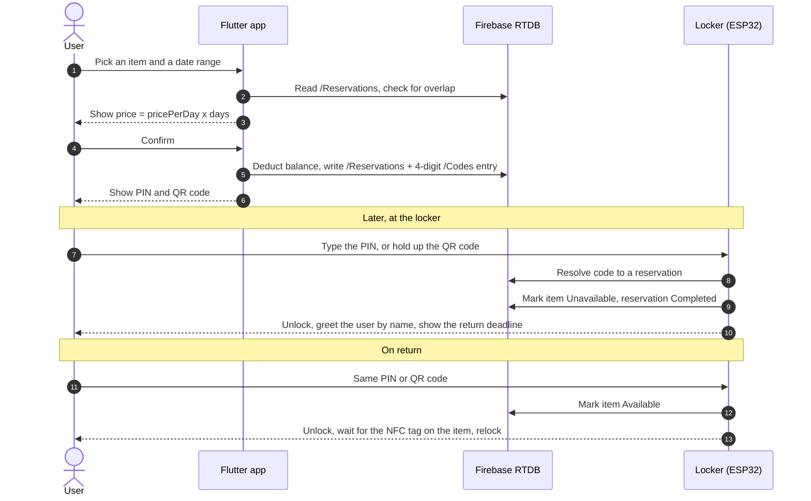
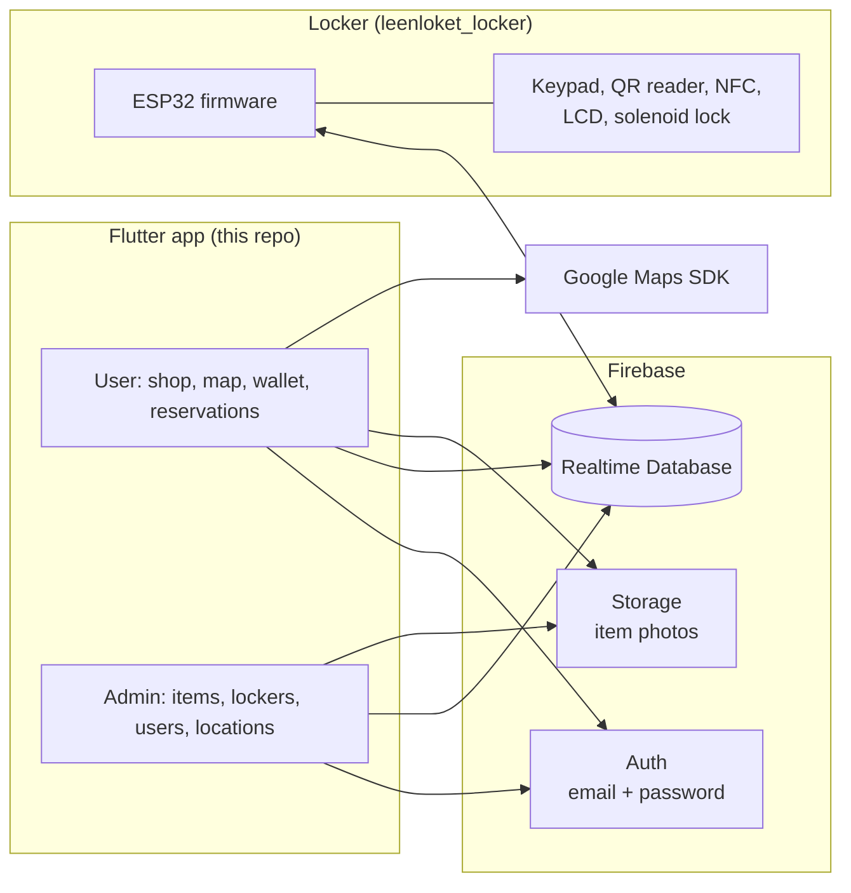
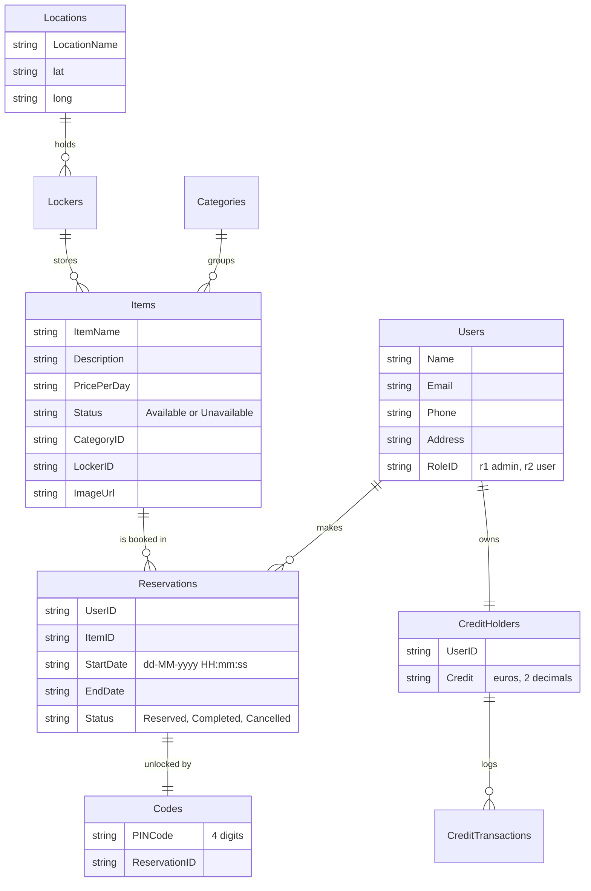

<p align="center">
  
</p>

<h3 align="center">Lend, use and return.</h3>

<p align="center">
  A Flutter app for a self-service tool library. Reserve a drill from your phone,
  walk to the locker it lives in, and open that locker with a PIN or a QR code.
</p>

---

LeenLoket ("lending desk" in Dutch) is a two-part system. This repository holds the
mobile app; [**leenloket_locker**](https://github.com/danieltyukov/leenloket_locker)
holds the firmware for the physical locker the app unlocks. Both talk to the same
Firebase Realtime Database and never talk to each other directly.

The idea: instead of buying a drill you use twice a year, you book one for an
afternoon. Lockers sit at fixed locations around a campus or a neighbourhood, and each
item is assigned to one of them. You pay per day out of a prepaid credit balance, and
the locker tracks pickup and return on its own.

## How a rental works



The same code works for both pickup and return. The locker decides which one is
happening by looking at the reservation status and the item status, which is why
nothing extra needs to be handed to the user on the way back.

## System shape



There is no backend of our own. The app and the firmware are both Realtime Database
clients, and the database is the only thing they share.

## Data model

Everything lives under nine top-level Realtime Database nodes: `Users`, `Items`,
`Reservations`, `Codes`, `CreditHolders`, `CreditTransactions`, `Categories`, `Lockers`
and `Locations`. Keys are Firebase push IDs unless noted.



The `Users/<uid>` key is the Firebase Auth UID, so a signed-in user maps straight onto
their profile. `Codes` is deliberately a separate node rather than a field on the
reservation: the locker only ever needs to read `Codes` to turn four typed digits into
a reservation, and the QR path skips it entirely by encoding the reservation ID.

Statuses drive the whole flow. A reservation starts `Reserved`, flips to `Completed`
the moment the item is collected, and the item flips `Available` to `Unavailable`
alongside it. The pair of them is what tells the locker whether the person standing in
front of it is picking up or dropping off.

## What is in the app

**For renters**

- Onboarding and email/password sign-in over Rive-animated screens
- A home tab with a date-range picker at the top, so availability is always shown for
  the window you actually want
- A shop listing that filters to items that are free for that window, and item pages
  with photos, price per day and pickup location
- A two-step booking flow: confirm details, then pay from your credit balance
- A prepaid wallet with a transaction history
- Reservations list, each one showing its 4-digit PIN and a QR code, with cancellation
- A Google Map of every locker location
- Profile, side menu and a light/dark theme setting

**For admins** (`RoleID` of `r1`, which routes to a separate home screen at launch)

- CRUD for items, categories, lockers and locations
- A user list, plus the ability to top up someone's credit balance
- A view of every reservation in the system

## Project layout

```
lib/
  main.dart                     Firebase init, settings load, runApp
  firebase_options.dart         FlutterFire-generated config
  src/
    app.dart                    MaterialApp, onGenerateRoute, role-based landing
    models/                     Plain data classes plus their RTDB queries
    utils/                      Auth helpers, date formatting, reservation codes
    views/
      authentication/           Onboarding, sign-in dialog, registration
      user/                     home, shop, reserving, reservations, credit,
                                favorites, locations, profile, settings
      admin/                    items, categories, lockers, locations,
                                users, reservations
    widgets/                    Shared widgets
    localization/app_en.arb     Strings (English only so far)
assets/
  fonts/                        Inter, Poppins
  images/                       Logo, app icon, sample item photos
  rive/                         Onboarding, nav bar icons, button animations
```

Models are not plain DTOs. `Item.isAvailable()`, `User.deductCredit()` and friends run
their own database queries, so the model layer doubles as the data access layer. That
keeps the views short but means any screen holding a model can hit the network.

## Running it

The Firebase project this was built against
(`tue-leenloket-default-rtdb`) has been deactivated, so a fresh clone will build and
launch but cannot sign in. To run it for real you need to point it at a Firebase
project of your own.

```bash
flutter pub get
flutter run
```

To get past the login screen:

1. Create a Firebase project with **Realtime Database**, **Authentication**
   (Email/Password provider) and **Storage** enabled.
2. Regenerate the config, which overwrites `lib/firebase_options.dart` and the
   platform config files:
   ```bash
   dart pub global activate flutterfire_cli
   flutterfire configure
   ```
3. Seed the database with a `Categories` entry, a `Locations` entry, a `Lockers` entry
   pointing at that location, and an `Items` entry with `Status: "Available"`. Register
   through the app to create your user, then flip that user's `RoleID` to `r1` in the
   console if you want the admin screens.
4. Replace the Google Maps key in `android/app/src/main/AndroidManifest.xml` with your
   own, or the locations map will render as a grey rectangle.

Requires the Flutter SDK; the project was written against Dart 3.2 with Android
`minSdkVersion` 20.

## Known limitations

This was a student project and it stops where the deadline did.

- **Secrets are committed.** A Google Maps API key sits in the Android manifest and the
  generated Firebase config is in the tree. Both belong to a dead project, but if you
  fork this, rotate anything you reuse.
- **`createReservationCode()` does not actually guarantee uniqueness.** It checks for a
  collision asynchronously and returns the candidate before the check resolves, so the
  recursive retry never affects the returned value. With a 4-digit space and few active
  reservations it holds up in practice, not in principle.
- **Availability is checked client-side** by reading every reservation and filtering in
  Dart. There is no transaction around booking, so two people booking the same item at
  the same instant can both succeed.
- **`User.password` exists on the model** and is written to the database on
  registration. Auth is handled by Firebase, so this field should not be there.
- **Dates are stored as formatted strings**, not timestamps, which is why the firmware
  has to `sscanf` them back apart.
- **The third bottom-nav tab is dead.** `UserFavoriteItems` renders an empty box and
  still carries a copy-pasted `routeName` of `/admin/lockers/index`. Favorites were
  designed and never built.
- **Some of the tree is aspirational.** `google_sign_in` is a dependency, imported in
  `settings_view.dart` and never called, so only email/password auth is wired up.
  `nfc_tag_model.dart` is never referenced at all; NFC lives entirely in the firmware.
- English only, although the localization plumbing is in place.

## Credits

Built in late 2023 and early 2024 by Alex de Bont and
[Daniel Tyukov](https://github.com/danieltyukov). The locker hardware and firmware live
in [leenloket_locker](https://github.com/danieltyukov/leenloket_locker).

Released under the [MIT License](LICENSE).
